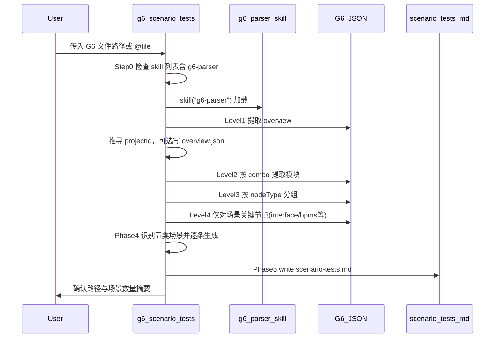
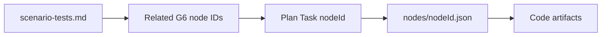
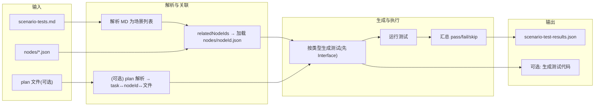

## 基于 Parser 生成代码的场景测试

本规范描述如何利用场景文档（`scenario-tests.md`）与 G6 缓存，对 G6 Parser 编排器（Parser Orchestrator）产出的代码进行校验，并详细说明**场景文档生成的内部流程**与**场景化测试执行的内部实现**，且不改变 g6-scenario-tests 与 parser 的职责边界。

---

### 摘要

本规范定义如何利用现有场景测试文档（`.opencode/g6/<projectId>/scenario-tests.md`）与 G6 节点缓存，对 parser 智能体（G6 → plan → build → coding）生成的代码做**场景级校验**。规范中明确了：（1）**场景文档如何从 G6 内部生成**（g6-scenario-tests 的阶段性流程、与 g6-parser skill 的配合、从节点/边到场景条目的推导规则）；（2）**场景化测试如何内部实现**（解析 scenario-tests.md、关联节点与计划、生成可执行测试、结果格式）。同时明确追溯关系（场景 ↔ nodeId ↔ 实现）、输入输出、场景类型与测试形态的映射、执行时机与分阶段实现思路。无需修改 g6-scenario-tests（仅产出文档）或 parser（仅负责调度）；任何可执行的场景测试由新组件（如 scenario-test-runner）负责。

---

### 目标

- 在保持现有 `scenario-tests.md` 格式与 G6 节点 ID 追溯能力的前提下，对 parser 生成的实现做场景级校验。
- 建立清晰的追溯模型：场景 ID 与 Related G6 node IDs → 计划任务 → 节点数据 → 代码产物。
- 支持可选的自动化：既可基于场景生成可执行测试（如 Interface → API 测试）并运行，也可仅产出映射/报告（如场景 ↔ 建议代码位置）供人工或半自动验证。
- 明确集成点，使场景测试可在编码完成后触发（如新 agent/命令），或在同时存在 `scenario-tests.md` 与 parser 生成代码时作为独立步骤执行。

---

### 非目标

- 不改变 g6-scenario-tests 智能体行为：其仍仅编写 `scenario-tests.md`（及可选的 overview）；不编写应用代码或测试代码。
- 不要求首版实现完整的端到端自动化；允许先采用人工或半自动的场景验证。
- 不修改 parser 智能体去直接写代码或跑测试；若将场景测试接入 parser 流程，仅通过 task 工具委托新的 agent 或命令完成。

---

### 现状

**场景文档生成（g6-scenario-tests）：**

- g6-scenario-tests 智能体通过 g6-parser skill（Level 1 → 2 → 3，仅对场景关键节点使用 Level 4）解析 G6 JSON，并写入 `.opencode/g6/<projectId>/scenario-tests.md`。
- 每个场景包含：**场景 ID**（如 SC-001）、**场景类型**（Interface | Process | Entity/Domain | Integration | E2E user）、**前置条件**、**步骤**、**预期结果**及 **Related G6 node IDs**。
- 场景按类型在 markdown 标题下分组（如 ## Interface scenarios）。

**Parser 实现链（parser 智能体）：**

- Parser 负责编排：G6 解析与缓存 → Plan 智能体 → Build 智能体（骨架与步骤注释）→ Coding 智能体（实现、单元测试、提交）。实现与 G6 的绑定通过 **nodeId** 完成：每个计划任务为 `Task: [nodeId] - [nodeLabel]`；节点详情存放在 `.opencode/g6/<projectId>/nodes/<nodeId>.json`；Build 与 Coding 智能体在生成代码时消费这些数据。

**缺口：**

- `scenario-tests.md` 仅被生成，从未被消费。Coding 智能体与 e2e-runner 均不读取该文件，当前也没有任何智能体对 parser 生成代码做基于场景的校验。
- 从自然语言场景步骤与预期结果到可执行测试之间，没有定义的映射与执行路径。

本设计在不动现有智能体契约的前提下，基于现有产物（`scenario-tests.md`、G6 缓存、计划、代码库）定义如何补充该校验路径。

---

### 一、场景文档生成的内部实现

本节描述 g6-scenario-tests 智能体**内部如何**从 G6 设计生成 `scenario-tests.md`，便于实现与后续「场景测试执行者」理解文档来源与结构。

#### 1.1 整体流程

g6-scenario-tests 严格按五阶段执行，且**必须**通过 g6-parser skill 做分层解析，禁止一次性加载完整 G6 JSON。



#### 1.2 各阶段与 g6-parser 层级的对应

| 阶段 | 智能体步骤 | g6-parser 用法 | 产出/用途 |
|------|------------|----------------|----------|
| Phase 1 | Step0 检查技能列表；Step1 解析用户输入得到 G6 路径 | — | 得到 G6 路径、确认 g6-parser 可用 |
| Phase 2 | Step2 提取概览 | **Level 1**：combos 摘要、节点/边按类型计数 | projectId、可选 `.opencode/g6/<projectId>/overview.json` |
| Phase 3 | Step3 按需分析 | **Level 2** 按 combo；**Level 3** 按 nodeType（interface、bpms-process、business-object 等）；**Level 4** 仅对「场景关键」节点（如 interface、bpms-process）取 endpoint/method/flow 等细节 | 得到各模块下节点列表与关键节点详情，用于识别场景 |
| Phase 4 | Step4 识别场景 | 基于 combos、nodes、edges 判定五类场景（见下表） | 内存中的场景列表（每条含 ID、类型、前置、步骤、预期、Related G6 node IDs） |
| Phase 5 | Step5–Step6 生成并写入 | — | **必须**用 write 工具写出完整 `.opencode/g6/<projectId>/scenario-tests.md`，且内容非空 |

#### 1.3 从 G6 到场景条目的推导规则

场景类型与 G6 来源、每条场景的生成逻辑如下（与 g6-scenario-tests 的 Phase 4 一致）：

| 场景类型 | G6 来源 | 内部推导要点 |
|----------|---------|--------------|
| **Interface** | interface 节点 + parameter-reference 边 | 每个 interface 节点至少一条「正常请求」场景；可选：参数校验失败、错误响应。从 Level 4 节点数据取 `data.endpoint`、`data.method`、`data.parameters` 用于描述步骤与预期。Related G6 node IDs 填该 interface 的 node id。 |
| **Process** | bpms-process + 相关边 | 每个 bpms-process 至少一条主流程场景；可选：分支、错误/回滚路径。Level 4 提供流程与边信息。Related G6 node IDs 填该 bpms-process 的 node id。 |
| **Entity/Domain** | business-object + cardinality-relationship | 关键实体：创建/读/更新、约束、关联查询。Related G6 node IDs 填对应 business-object（及关键关联）的 node id。 |
| **Integration** | interface-invoke、跨 combo 边 | 跨模块调用顺序、依赖、失败回滚。Related G6 node IDs 填涉及的 interface 或组合节点。 |
| **E2E user** | 多 interface + process | 将多条接口与流程组合为用户旅程：步骤、前置条件、预期结果。Related G6 node IDs 填涉及的多个 node id。 |

文档内每条场景**必须**包含的字段（与 g6-scenario-tests 的 Output format 一致）：**Scenario ID**、**Scenario name**、**Scenario type**、**Preconditions**、**Steps**、**Expected result**、**Related G6 node IDs**。场景按类型分块，使用 markdown 二级标题（如 `## Interface scenarios`）。

#### 1.4 文档结构约定（便于下游解析）

为便于「场景测试执行者」用程序解析，建议生成时遵守以下约定（与当前 g6-scenario-tests 示例一致）：

- 每个场景块以 `#### SC-xxx: 场景名` 形式的四级标题开始。
- 字段使用 `- **字段名**: 值` 的列表项；**Related G6 node IDs** 可写单个 id 或逗号分隔的多个 id。
- Steps 为有序列表（1. 2. 3. …）。

下游解析时可按「四级标题 + 列表项」或正则提取：Scenario ID（如 `SC-001`）、Scenario type、Preconditions、Steps、Expected result、Related G6 node IDs（可 split 为数组）。

#### 1.5 文档生成与测试执行的两条链路对照

| 维度 | 场景文档生成（g6-scenario-tests） | 场景化测试执行（scenario-test-runner） |
|------|-----------------------------------|----------------------------------------|
| 输入 | G6 JSON 文件路径 | scenario-tests.md、nodes/*.json、可选 plan、代码库 |
| 核心依赖 | g6-parser skill（Level 1–4 按需） | 无 skill；读已有缓存与文档 |
| 输出 | `.opencode/g6/<projectId>/scenario-tests.md` | `scenario-test-results.json`、可选生成测试代码 |
| 是否写代码 | 否，仅写 markdown | 仅写测试代码与结果，不写业务代码 |

---

### 追溯关系

**场景 ↔ 实现：**

- 场景中的 **Related G6 node IDs** 对应 G6 设计中的具体节点。
- 计划文件中任务以 `Task: [nodeId] - [nodeLabel]` 形式列出；每个 nodeId 在 `.opencode/g6/<projectId>/nodes/<nodeId>.json` 中有详细数据。
- Build 与 Coding 智能体根据这些节点生成类、控制器与测试；同一 nodeId 可用于定位实现代码（例如通过约定或从计划中解析每任务对应的文件路径）。

因此：**场景 → Related G6 node IDs → 该 nodeId 对应的计划任务 → nodes/<nodeId>.json → 代码产物**（控制器、服务、实体等）。



实现时可通过解析 `scenario-tests.md` 与计划文件，利用上述链路将每个场景与对应节点数据、以及在可能时与生成源码文件关联起来。

---

### 二、scenario-tests.md 的解析规范（供执行端使用）

场景测试执行者需要将 markdown 文档解析为结构化场景列表，以便关联节点、生成测试、写结果。推荐解析方式如下。

#### 2.1 区块划分

- 以 `#### SC-` 或 `### SC-` 开头的标题作为一条场景的起始；到下一个同类标题或到 `## ` 二级标题之前为该场景的正文。
- 若文档有 `## Interface scenarios` 等二级标题，可按二级标题分大块后再在块内按场景划分。

#### 2.2 字段提取

- **Scenario ID**：从标题中提取，如 `#### SC-001: 创建交接单成功` → `SC-001`。正则示例：`/####\s+(SC-\d+)\s*:/`。
- **Scenario type**：匹配 `- **Scenario type**: Interface` 等，取冒号后的值（Interface | Process | Entity/Domain | Integration | E2E user）。
- **Preconditions**、**Expected result**：同法取 `- **Preconditions**:`、`- **Expected result**:` 后的整行或到下一列表项为止。
- **Steps**：取 `- **Steps**:` 之后的有序列表（1. 2. 3. …），可合并为字符串数组或多行字符串。
- **Related G6 node IDs**：取 `- **Related G6 node IDs**:` 后的内容；若为逗号分隔则 split 成数组，用于后续与 `nodes/<nodeId>.json` 关联。

#### 2.3 结构化输出（内存/中间格式）

解析后建议得到如下结构（便于与节点、计划关联并生成测试）：

```json
{
  "scenarios": [
    {
      "id": "SC-001",
      "name": "创建交接单成功",
      "type": "Interface",
      "preconditions": "用户已登录；交接类型枚举已存在",
      "steps": ["调用 POST /api/handover 请求体为合法 JSON", "校验响应状态码 200，返回 body 含 id"],
      "expectedResult": "返回 201/200，body 含新创建的 id",
      "relatedNodeIds": ["interface-create-handover"]
    }
  ]
}
```

---

### 三、场景化测试执行的内部实现

本节描述「场景测试执行者」（新 agent 或命令）**内部如何**实现：解析文档 → 关联节点与计划 → 按场景类型生成可执行测试 → 运行并写结果。

#### 3.1 整体数据流



#### 3.2 解析与关联步骤（对应阶段一）

1. **解析 scenario-tests.md**：按「二、scenario-tests.md 的解析规范」得到 `scenarios[]`。
2. **解析 projectId**：从路径 `.opencode/g6/<projectId>/scenario-tests.md` 取 projectId，或从同目录下 `metadata.json` 读取。
3. **关联节点**：对每个场景的 `relatedNodeIds`，逐个尝试读取 `.opencode/g6/<projectId>/nodes/<nodeId>.json`。若存在则解析为 Level 4 结构（含 `node`、`outgoingEdges`、`incomingEdges`、`dependencies`、`implementationRequirements`），建立 `scenarioId → [nodeId → nodeData]` 的映射。
4. **可选：关联计划**：若存在 `.opencode/plans/g6-implementation-<timestamp>.md`，用正则提取 `### Task: [nodeId] - [nodeLabel]` 及后续内容；若计划中写明了生成文件路径，可进一步建立 `nodeId → 建议文件路径`，便于定位实现类（如 Controller）。

产出：**映射报告**（场景 ↔ nodeIds ↔ 建议代码位置），可不执行测试仅输出该报告。

#### 3.3 Interface 场景 → 可执行 API 测试的生成逻辑（对应阶段二）

对 `type === "Interface"` 的场景，结合节点数据与场景步骤/预期，生成可执行 API 测试。核心逻辑如下。

1. **从节点数据取接口契约**  
   - 读取该场景关联的 interface 节点对应的 `nodes/<nodeId>.json`。  
   - 从 `node.data` 中取：`endpoint`（如 `/api/handover`）、`method`（如 `POST`）、`parameters`（请求/响应结构）。若 Level 4 的 `implementationRequirements` 中有规范化说明，一并使用。

2. **从场景步骤与预期取用例意图**  
   - **Steps**：解析「调用 POST /api/…」「校验响应状态码 200」等，得到：请求方法+路径、请求体要求、要校验的状态码与 body 字段。  
   - **Expected result**：解析「返回 201/200，body 含 id」等，得到：允许的状态码集合、响应 body 必须包含的字段（如 `id`）。

3. **生成测试代码（示例：JUnit + RestAssured）**  
   - 根据 `method` + `endpoint` 构造请求；若有 `parameters` 或步骤中描述的 body，构造 JSON body。  
   - 断言：状态码 in 允许集合；响应 body 包含所需字段（如 `body.path("id")` 非空）。  
   - 测试类/方法名可包含 Scenario ID（如 `SC001_创建交接单成功`），便于结果汇总时对应回场景。

4. **运行与结果汇总**  
   - 执行生成的测试（或项目既有 API 测试栈），收集每个测试的 pass/fail；若某场景对应多个用例，可按「全部通过 → 该场景 pass，否则 fail」的规则汇总。  
   - 将「场景 ID → pass/fail/skip + 原因」写入 `scenario-test-results.json`（格式见下）。

Process、Entity/Domain、Integration、E2E 可在阶段三用类似思路扩展：从对应节点类型与边的数据中抽取「步骤/状态/依赖」，再映射到流程测试、领域测试、集成测试或 E2E 脚本。

#### 3.4 结果文件格式（scenario-test-results.json）

建议结构（便于 CI 或 opencode 会话内展示）：

```json
{
  "projectId": "merged-output-23-01",
  "generatedAt": "2025-02-04T12:00:00Z",
  "sourceDocument": ".opencode/g6/merged-output-23-01/scenario-tests.md",
  "results": [
    {
      "scenarioId": "SC-001",
      "scenarioName": "创建交接单成功",
      "scenarioType": "Interface",
      "status": "pass",
      "reason": "API 返回 200，body 含 id",
      "relatedNodeIds": ["interface-create-handover"]
    },
    {
      "scenarioId": "SC-002",
      "scenarioName": "创建交接单参数校验失败",
      "scenarioType": "Interface",
      "status": "skip",
      "reason": "场景暂未生成可执行测试"
    }
  ],
  "summary": { "total": 2, "pass": 1, "fail": 0, "skip": 1 }
}
```

`status` 取值：`pass` | `fail` | `skip`。`reason` 为简短说明。

---

### 四、数据结构与文件格式约定

#### 4.1 G6 节点 Level 4 输出（nodes/<nodeId>.json）

与 g6-parser skill 一致，每个节点文件为 Level 4 的完整输出，结构示例：

```json
{
  "node": {
    "id": "interface-create-handover",
    "label": "创建交接单",
    "nodeType": "interface",
    "comboId": "service-layer-xxx",
    "data": {
      "endpoint": "/api/handover",
      "method": "POST",
      "parameters": { "request": "...", "response": "..." },
      "description": "..."
    }
  },
  "outgoingEdges": [],
  "incomingEdges": [],
  "dependencies": { "requires": [], "requiredBy": [] },
  "implementationRequirements": { "type": "interface", "specifications": {} }
}
```

场景测试执行者主要使用 `node.nodeType`、`node.data.endpoint`、`node.data.method`、`node.data.parameters` 与 Interface 场景的步骤/预期做匹配并生成 API 测试。

#### 4.2 映射报告（阶段一可选产出）

若仅做「解析与映射」、不执行测试，可输出如下格式（如 `.opencode/g6/<projectId>/scenario-mapping.json`）：

```json
{
  "projectId": "merged-output-23-01",
  "scenarios": [
    {
      "scenarioId": "SC-001",
      "relatedNodeIds": ["interface-create-handover"],
      "nodeDataPaths": [".opencode/g6/merged-output-23-01/nodes/interface-create-handover.json"],
      "suggestedCodeLocations": ["src/main/java/.../controller/HandoverController.java"]
    }
  ]
}
```

`suggestedCodeLocations` 来自对 plan 的解析或项目约定（如 controller 包路径），若无法推断可省略或为空数组。

---

### 输入与输出

**输入：**

- `.opencode/g6/<projectId>/scenario-tests.md` — 场景列表（含 ID、类型、步骤、预期结果、Related G6 node IDs）。
- `.opencode/g6/<projectId>/nodes/*.json` — 各节点设计数据（如 interface 的 endpoint、method、parameters；process 的流程数据等）。
- `.opencode/g6/<projectId>/overview.json`（可选）— combo 与节点/边数量统计。
- `.opencode/g6/<projectId>/metadata.json`（可选）— projectId、源路径、时间戳等。
- Parser 生成的代码库（plan → build → coding 后的当前工作树）。
- `.opencode/plans/g6-implementation-<timestamp>.md`（可选）— 当计划中记录了每任务生成的文件时，用于 task ↔ nodeId ↔ 文件映射。

**输出：**

- **场景级结果：** 对每个场景 ID（如 SC-001）给出结果：pass | fail | skip，并附简短原因（如「接口返回 200 且 body 含 id」「场景暂不可执行」「缺少端点」等）。
- **可选：** 生成的可执行测试代码（如 Interface 场景 → API 测试）及运行报告（如 JUnit/Playwright 输出），写入约定目录（见「文件与目录约定」）。

---

### 场景类型与测试形态

与 g6-scenario-tests 产出的场景类型对齐，并给出建议的测试形态（首版实现不必全部支持）：

| 场景类型       | G6 来源                           | 建议测试形态                                                                 |
|----------------|------------------------------------|-----------------------------------------------------------------------------|
| **Interface**  | interface 节点 + parameter-reference | API 测试：HTTP 方法/URL、请求体、状态码、响应体/字段（如 JUnit + RestAssured 或项目既有 API 测试框架）。 |
| **Process**    | bpms-process + edges               | 流程/状态或服务层测试：步骤、分支、异常路径、超时/重试。                      |
| **Entity/Domain** | business-object + cardinality  | 领域/实体或仓储测试：生命周期、约束、关联。                                  |
| **Integration**   | interface-invoke、跨 combo 边   | 集成测试：跨模块调用顺序、依赖、失败回滚。                                    |
| **E2E user**   | 多 interface + process            | E2E 测试：多步骤链路（API 链或 UI，如 Playwright）。                         |

首版可仅支持 **Interface**（及可选的 **Integration**）；Process、Entity/Domain、E2E 可在后续阶段补充。

---

### 执行模型

**何时执行场景测试：**

- **选项 A — 编码完成后：** Parser 在 Coding 智能体完成后，通过 task 工具将「场景测试」步骤委托给新的子智能体或命令，场景测试作为同一次 G6 实现流程的一部分执行。
- **选项 B — 独立命令（首版推荐）：** 用户在手头同时有 `scenario-tests.md` 与 parser 生成代码时，主动调用专用命令（如 `g6.scenario-test-run`）。不改动 parser，与 parser 解耦。

**由谁执行场景测试：**

- 独立的「场景测试执行者」（新 agent 或命令）：仅读取 `scenario-tests.md`、G6 缓存（nodes、overview、可选的 metadata/plan）与代码库；可生成并运行测试或调用外部测试 runner。仅允许写入：
  - 结果文件（如 `.opencode/g6/<projectId>/scenario-test-results.json`），以及
  - 可选的、在约定测试目录下生成的测试代码（见下文）。

不得修改应用源码；仅在约定位置新增或更新测试代码。

---

### 建议实现路径

实现时可与**第三节「场景化测试执行的内部实现」**对应：阶段一对应解析与关联（3.2）；阶段二对应 Interface 测试生成与运行（3.3）；阶段三对应其余场景类型与集成。

**阶段一 — 解析与映射（不执行测试）：**

- 按**第二节「scenario-tests.md 的解析规范」**解析文档，得到结构化场景列表（含场景 ID、类型、前置条件、步骤、预期结果、Related G6 node IDs）。
- 将每个 Related G6 node ID 解析到 `.opencode/g6/<projectId>/nodes/<nodeId>.json`（结构见**第四节 4.1**），若有计划则按 3.2 关联到对应计划任务与建议代码位置。
- 产出映射报告（格式见**第四节 4.2**）：场景 ↔ nodeIds ↔ 建议代码位置。本阶段不执行测试。

**阶段二 — Interface 场景：可执行 API 测试：**

- 对 Interface 类型场景，按**第三节 3.3**：从节点 `node.data` 取 endpoint、method、parameters，从场景 Steps/Expected result 解析请求与断言意图，生成可执行 API 测试（如 JUnit + RestAssured 或项目既有 API 测试栈）。
- 运行这些测试，按场景（或按与场景 ID 关联的生成用例）汇总 pass/fail/skip。
- 将结果以**第三节 3.4**的格式写入 `scenario-test-results.json`。

**阶段三 — 扩展覆盖与集成：**

- 扩展至 Process、Entity/Domain、Integration、E2E（按 3.3 末尾思路：从对应节点类型与边数据抽取步骤/状态/依赖，生成流程测试、仓储测试、集成测试、E2E 脚本）。
- 统一报告格式与写入位置；可选与 CI 或 opencode 会话 UI 集成（如在会话中展示场景 pass/fail）。

---

### 文件与目录约定

- **G6 缓存只读：** 对 `.opencode/g6/<projectId>/`（scenario-tests.md、nodes/、overview.json、metadata.json）的读取保持只读；场景测试执行者不得覆盖已有 G6 缓存文件。
- **结果文件：** 场景测试结果可写入 `.opencode/g6/<projectId>/scenario-test-results.json`（或 `.opencode/` 下其他约定路径），与业务源码分离。
- **生成的测试代码：** 若执行者生成测试代码，应放在项目约定的测试目录下（如 `src/test/scenario/` 或项目既有测试树），并遵循项目测试布局；设计上应避免覆盖用户手写测试（如使用专用子目录或文件前缀）。

---

### 五、子智能体：场景测试执行者（g6-scenario-test-runner）

本节明确针对「场景测试文档」执行并判断是否满足场景要求的**子智能体**的职责、输入输出、判断逻辑与触发方式。

#### 5.1 职责

- **仅消费**已生成的 `scenario-tests.md` 与 G6 缓存/代码库；**不生成**场景文档。
- **解析**场景文档（按第二节规范）、**关联** Related G6 node IDs 与 `nodes/<nodeId>.json`、**按场景类型执行校验**（首版支持 Interface：生成/运行 API 测试）、**判断**每条场景是否满足要求（pass / fail / skip）并写出原因。
- **写出** `.opencode/g6/<projectId>/scenario-test-results.json`（必选），及可选的在约定测试目录下的生成测试代码；**不修改**业务源码，**不覆盖** G6 缓存中的 scenario-tests.md、nodes 等。

#### 5.2 输入与输出

与本文第三节、第四节一致：

- **输入**：必选 scenario-tests.md 路径（或 projectId）、当前工作树；推荐 `nodes/*.json`；可选 metadata.json、plan 文件。
- **输出**：必选 scenario-test-results.json（格式见 3.4）；可选 scenario-mapping.json、`src/test/scenario/` 下生成的测试代码。

#### 5.3 工作流与判断逻辑

- **Phase 1 — 解析与关联**：获取并解析 scenario-tests.md，得到结构化场景列表；解析 projectId；加载相关 `nodes/<nodeId>.json`，建立 scenarioId → nodeData 映射；可选解析 plan 得到 task↔nodeId↔文件。
- **Phase 2 — 按场景类型执行与判断**：对 Interface 场景，根据节点 endpoint/method/parameters 与场景 Steps/Expected result 生成并运行 API 测试，按运行结果给出 pass（断言全过）/ fail（断言或请求失败）/ skip（无法生成或运行）；对 Process/Entity/Integration/E2E 首版可标 skip 并注明暂不支持。
- **Phase 3 — 写结果与汇报**：将全部场景的 status、reason、relatedNodeIds 及 summary 写入 scenario-test-results.json，并向用户汇报路径与摘要。

**满足场景要求**的定义：该场景下可执行校验（如 API 请求+断言）全部通过则为 **pass**；任一处失败则为 **fail**；无法执行校验则为 **skip**。

#### 5.4 触发方式

- **方式 A — Parser 委托（可选）**：Parser 在 Phase 7（Coding 智能体）完成后，若存在 `.opencode/g6/<projectId>/scenario-tests.md`，可通过 `task({ subagent_type: "g6-scenario-test-runner", ... })` 委托本子智能体执行；prompt 中传入 projectId 与场景文档路径。
- **方式 B — 独立命令（推荐首版）**：用户主动执行命令 `g6.scenario-test-run`，传入 scenario-tests.md 路径或 projectId；命令绑定 agent `g6-scenario-test-runner`，由子智能体解析并执行判断。

#### 5.5 注册位置

- **Agent**：`packages/opencode/src/agent/agent.ts` — 条目 `g6-scenario-test-runner`，prompt 来自 `packages/opencode/src/agent/prompt/g6-scenario-test-runner.txt`；权限为 read/glob/grep/list/bash 允许，write/edit 仅允许 `.opencode/g6/**` 与 `**/src/test/scenario/**`。
- **Command**：`packages/opencode/src/command/index.ts` — Default 枚举 `G6_SCENARIO_TEST_RUN`（`g6.scenario-test-run`），对应 agent `g6-scenario-test-runner`，template 为 `packages/opencode/src/command/template/g6-scenario-test-run.txt`。
- **Parser 委托**：`packages/opencode/src/agent/prompt/parser.txt` — Phase 7 后可选步骤 10.2，在存在 scenario-tests.md 时通过 task 调用 `subagent_type: "g6-scenario-test-runner"`。

---

### 参考资料

- **g6-scenario-tests 智能体 prompt：** `packages/opencode/src/agent/prompt/g6-scenario-tests.txt` — 场景输出格式、场景类型、Related G6 node IDs 及工作流。
- **Parser 智能体 prompt：** `packages/opencode/src/agent/prompt/parser.txt` — G6 → plan → build → coding 流程，任务格式 `Task: [nodeId] - [nodeLabel]`，以及 `.opencode/g6/<projectId>/nodes/<nodeId>.json` 的用法。
- **g6-parser skill：** `packages/opencode/skills/g6-parser/SKILL.md` — G6 结构、Level 1–4 分解及节点/边数据形态。
- **计划文件格式：** parser.txt 中的「Plan File Format」— `.opencode/plans/g6-implementation-<timestamp>.md` 的结构及 G6 Design Reference（metadata、overview、modules、nodes 路径）。
- **示例场景条目：** g6-scenario-tests.txt 中的单条场景块：场景 ID、类型、前置条件、步骤、预期结果、Related G6 node IDs。
- **场景测试执行者 prompt：** `packages/opencode/src/agent/prompt/g6-scenario-test-runner.txt` — 针对 scenario-tests.md 的执行与判断工作流、Phase 1–3、结果格式与权限约束。
